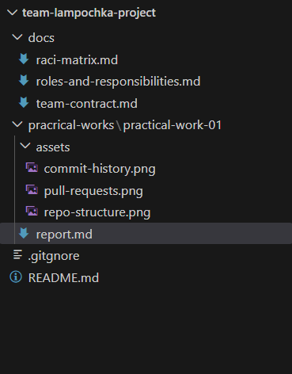
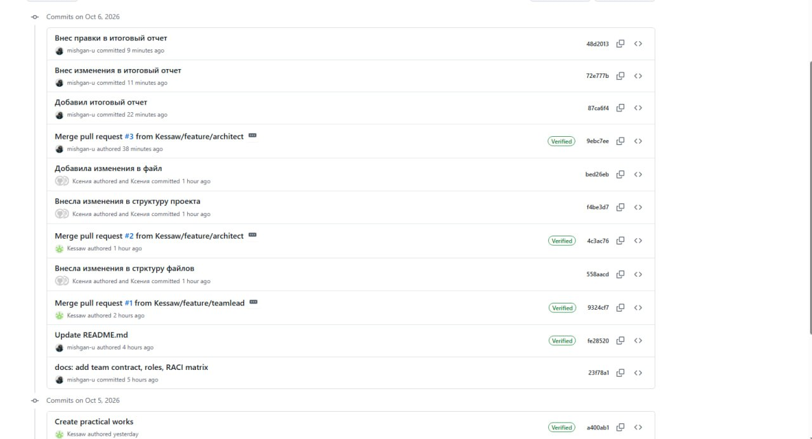
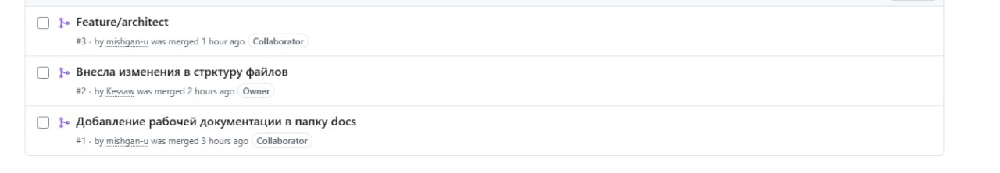

# Отчёт по самостоятельной работе №2

**Тема:** Организация работы с репозиторием проекта и распределение ответственности в Git
**Команда:** «Лампочка»
**Репозиторий:** [team-lampochka-project](https://github.com/Kessaw/team-lampochka-project)

---

## 1. Подтверждение регистрации участников на GitHub

Все участники команды зарегистрированы на платформе GitHub и добавлены в командный репозиторий.

| ФИО участника    | Роль в проекте             | Логин GitHub          |
| ---------------- | -------------------------- | --------------------- |
| Макаров Михаил   | Руководитель разработки    | `mishgan-u`    |
| Кирюхина Ксения  | Архитектор ПО              | `Kessaw`  |
| Кудряшов Виталий | Специалист по данным       | `VVT331` |
| Козлов Кирилл    | Специалист по тестированию | ``      |
| Лайкевич Андрей  | Программист                | ``   |

---

## 2. Командный репозиторий

Для совместной работы был создан командный репозиторий:

**[team-lampochka-project](https://github.com/Kessaw/team-lampochka-project)**

Репозиторий используется для хранения документации проекта, результатов практических работ и сопутствующих материалов.

---

## 3. Структура репозитория

Репозиторий организован в соответствии со структурой, указанной в задании.

На следующем скриншоте представлена структура репозитория на GitHub:



---

## 4. Распределение обязанностей по работе с Git

Распределение ответственности выполняется на основе ролей и матрицы RACI, разработанных в рамках самостоятельной работы №1.

### Создание и настройка репозитория

* **R (Responsible):** руководитель разработки / архитектор ПО.
* **A (Accountable):** руководитель разработки.

### Поддержание структуры репозитория

* **R:** каждый участник отвечает за материалы в рамках своей роли.
* **A:** руководитель разработки.

### Подготовка отчётов по практическим работам

* **R:** участники команды в соответствии со своими ролями.
* **A:** руководитель разработки.

### Создание коммитов

* **R:** каждый участник за внесённые им изменения.
* **A:** руководитель разработки.

Коммиты выполняются с осмысленными сообщениями, отражающими содержание внесённых изменений.

### Проверка Pull Request

* **R:** руководитель разработки и архитектор ПО.
* **A:** руководитель разработки.

### Слияние веток

* **R:** руководитель разработки.
* **A:** руководитель разработки.

### Поддержание актуальности репозитория

* **R:** все участники команды.
* **A:** руководитель разработки.

---

## 5. Практическая работа с Git

Для выполнения задания участники использовали систему контроля версий Git и платформу GitHub.

Каждый участник:

1. Клонировал командный репозиторий на локальный компьютер.
2. Создал отдельную ветку для выполнения своей части работы.
3. Внёс необходимые изменения.
4. Создал коммит с описанием выполненной работы.
5. Отправил ветку в удалённый репозиторий с помощью `push`.
6. Создал Pull Request в основную ветку `main`.
7. Получил ревью от другого участника команды.
8. После проверки изменения были объединены с веткой `main`.

### Используемые ветки

| Участник         | Ветка                      |
| ---------------- | -------------------------- |
| Макаров Михаил   | `feature/teamlead` |
| Кирюхина Ксения  | `feature/architect` |
| Кудряшов Виталий | `feature/`     |
| Козлов Кирилл    | `feature/`        |
| Лайкевич Андрей  | `feature/programmer` |

---

## 6. История коммитов

История коммитов позволяет определить автора каждого изменения и отследить последовательность работы над проектом.

В процессе выполнения самостоятельной работы участники создавали коммиты с описательными сообщениями, например:

```text
 внес правки в итоговый отчет        
 обновил матрицу ответственности
 
```

История изменений командного репозитория представлена на скриншоте:



---

## 7. Pull Request

Для объединения изменений с основной веткой `main` использовался механизм Pull Request.

Участник создавал Pull Request из своей рабочей ветки, после чего другой участник команды выполнял проверку внесённых изменений.

После успешного ревью Pull Request объединялся с веткой `main`.

Список Pull Request представлен на следующем скриншоте:




## 8. Результат работы

В результате выполнения самостоятельной работы был создан и настроен единый командный репозиторий GitHub.

В репозитории:

* создана необходимая структура каталогов;
* размещена документация проекта;
* созданы отдельные ветки участников;
* выполнены коммиты от разных участников;
* использован механизм Pull Request;
* проведено ревью изменений;
* изменения объединены с основной веткой `main`.

Таким образом, каждый участник внёс свой вклад в общий проект, а история Git позволяет определить автора и содержание каждого изменения.

---

## 9. Вывод

В ходе выполнения самостоятельной работы были получены практические навыки работы с Git и GitHub в рамках командного проекта.

Использование отдельных веток позволяет участникам независимо работать над своими задачами, не изменяя напрямую основную ветку проекта. Pull Request и Code Review обеспечивают дополнительную проверку изменений перед их объединением с `main`.

История коммитов позволяет отследить вклад каждого участника команды и определить, какие изменения были внесены каждым разработчиком.

Таким образом, Git и GitHub позволяют организовать совместную разработку, распределить ответственность между участниками и сохранить историю развития проекта.
